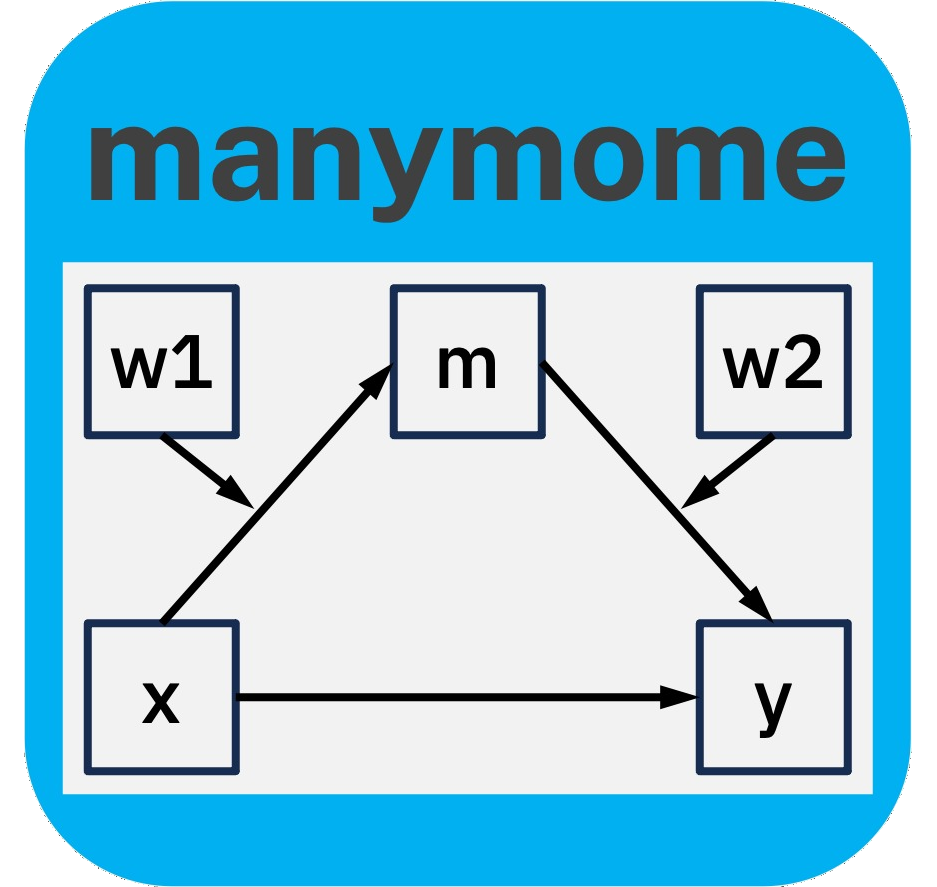

### About Me

I am Shu Fai. I like helping people, me included, to do analysis in psychological studies. These are the R packages and other tools I am working on:

#### Structural Equation Modelling (SEM)

[`manymome`](https://sfcheung.github.io/manymome/): Moderation (`mo`), mediation (`me`), and moderated mediation (`mome`) in "`many`" models. In colaboration with S.-H. Cheung ([Cheung & Cheung, 2023](https://doi.org/10.3758/s13428-023-02224-z)). Our goals: Do things fast and do them right. This package is for computing indirect effects and conditional indirect effects fast and easy, with as little coding as possible. ([A quick introduction](https://sfcheung.github.io/manymome/articles/manymome.html))

[`semlbci`](https://sfcheung.github.io/semlbci/): Likelihood-based confidence interval (`lbci`) in `sem`. LBCI is a useful but underused method to form CI in SEM. I hope more researchers can use this method ([Cheung & Pesigan, 2023](https://doi.org/10.1080/10705511.2023.2183860)). ([Get started](https://sfcheung.github.io/semlbci/articles/semlbci.html))

[`semfindr`](https://sfcheung.github.io/semfindr/): A finder (hence `findr`) for finding influential cases in an SEM analysis, in collaboration with Mark H. C. Lai. We should always see if there are any influential cases in SEM but this is not easy, even for me as I have projects with large samples with missing data. We hope this package, with efficiency and easiness-to-use in mind, can help more researchers to do this. (No, outliers are not necessarily influential cases, and influential cases are not necessarily outiers. Checking for outliers is *not enough*.) ([How to use it](https://sfcheung.github.io/semfindr/articles/semfindr.html))

[`semptools`](https://sfcheung.github.io/semptools/): Helpers for customizing an SEM figure generated by [`semPlot::semPaths()`](https://rdrr.io/pkg/semPlot/man/semPaths.html), in collaboration with Mark H. C. Lai. It helped me a lot to generate publication-ready and teaching-ready SEM figures *quickly*. ([A quick start guide](https://sfcheung.github.io/semptools/articles/semptools.html))

[`semhelpinghands`](https://sfcheung.github.io/semhelpinghands/): Helper functions I wrote to help myself to do some common tasks in SEM efficiently. See [this page](https://sfcheung.github.io/semhelpinghands/articles/semhelpinghands.html) for an overview.

#### Multiple Regression

[`stdmod`](https://sfcheung.github.io/stdmod/): Started out as a package for doing standardized moderation *right* (many did it wrong) in linear regression but now a tool for doing standardization *right* in linear regression, including moderated regression ([Cheung, Cheung, Lau, Hui, & Vong, 2022](https://doi.org/10.1037/hea0001188)). The usual method for confidence intervals is wrong and I hope this package (among others) can help people to form better CIs. it supports bootstrap confidence intervals. Illustrations can be found [here for moderated regression](https://blogonresearch.github.io/posts/std_mod/) and [here for a regression model with categorical predictors](https://blogonresearch.github.io/posts/std_dummy/).

[`manymome`](https://sfcheung.github.io/manymome/): Again? Yes, because it can also be used for regression models 😄! Moderation (`mo`), mediation (`me`), and moderated mediation (`mome`) in "`many`" regression models, fitted by several one-outcome regression models using `lm()`. In colaboration with S.-H. Cheung ([Cheung & Cheung, 2023](https://doi.org/10.3758/s13428-023-02224-z)). Our goal: Do things fast, and do them right. This package is for computing indirect effects and conditional indirect effects fast and easy, with as little coding as possible. Illustrations can be found in [this page for mediation](https://sfcheung.github.io/manymome/articles/med_lm.html) and [this page for moderated mediation](https://sfcheung.github.io/manymome/articles/mome_lm.html).

#### SPSS

[`DIY Bootstrapping in SPSS`](https://github.com/sfcheung/diybootstat): For forming nonparametric bootstrap confidence intervals for literally anything we can see in the SPSS output ([Cheung, Pesigan, & Vong, 2023](https://doi.org/10.3758/s13428-022-01808-5)). Flexibility comes at a cost ... some coding in inevitable. But I meant it: Anything we can see, including standardized regression coefficients ("betas") and adjusted R-squares, reliability coefficients, and many other statistics. Video demonstration can be found [here](https://youtube.com/playlist?list=PLIPS5VeTqgUoSlg2b-EIiCKU7vxwWEYY0&feature=shared).

Hope you find the tools useful. (I certainly do find the tools useful because I usually develop tools that I myself also want to use in my research. 😊)

I would love to see bug reports and suggestions. Feel free to raise them in the corresponding GitHub issues pages. Thanks. 🙏🙂

<!--
**sfcheung/sfcheung** is a ✨ _special_ ✨ repository because its `README.md` (this file) appears on your GitHub profile.

Here are some ideas to get you started:

- 🔭 I’m currently working on ...
- 🌱 I’m currently learning ...
- 👯 I’m looking to collaborate on ...
- 🤔 I’m looking for help with ...
- 💬 Ask me about ...
- 📫 How to reach me: ...
- 😄 Pronouns: ...
- ⚡ Fun fact: ...
-->
