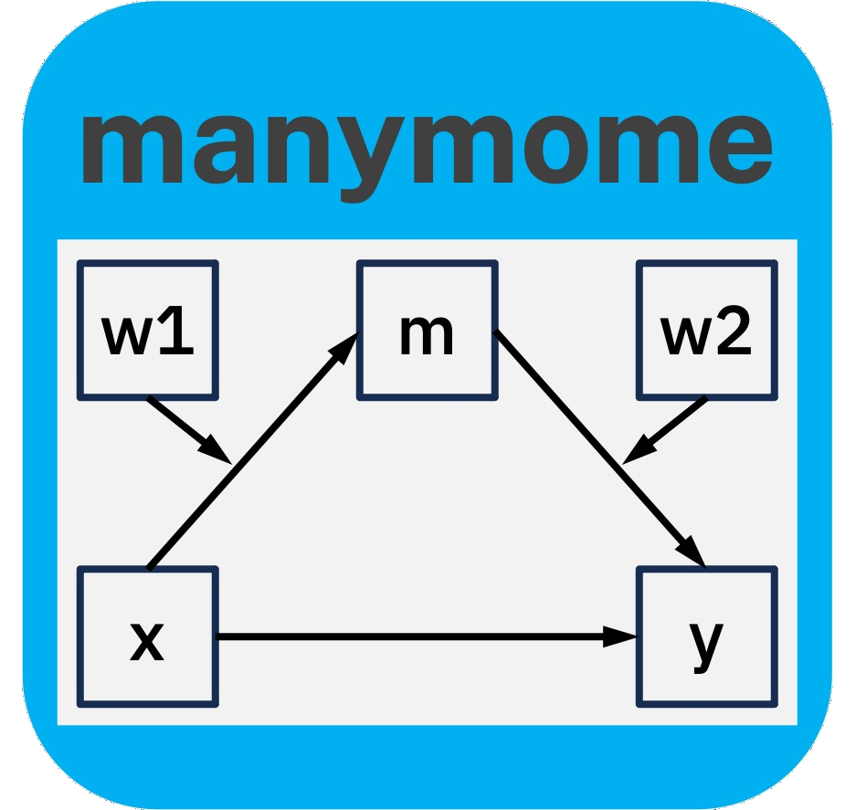
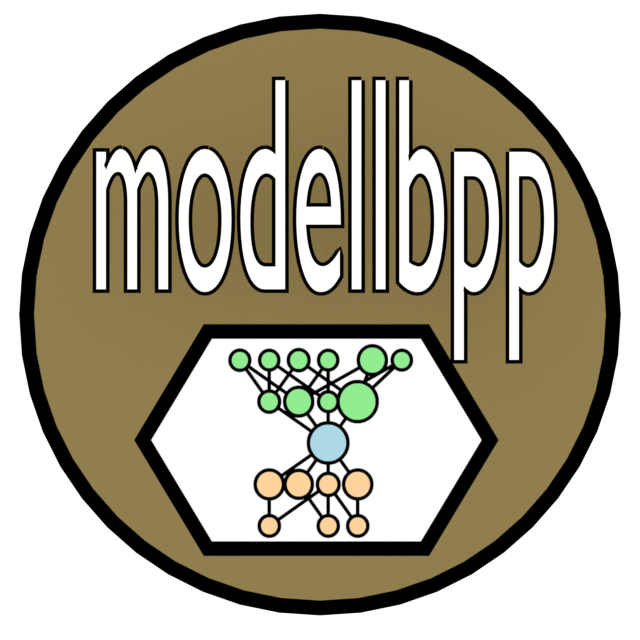
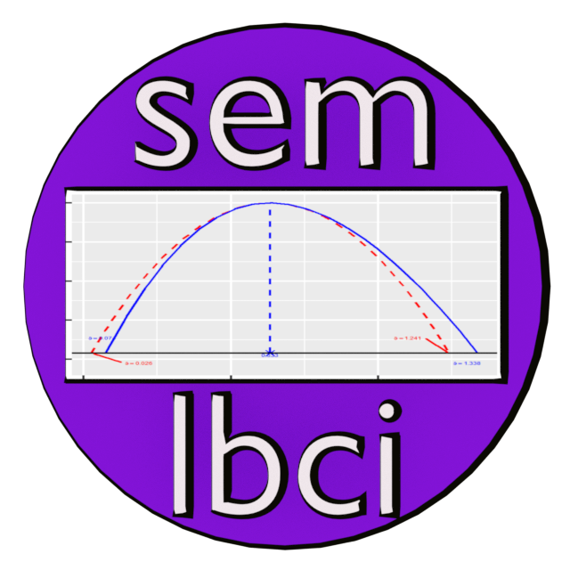

### About Me

I am Shu Fai. I like helping people, including myself, with analysis in psychological studies. These are the R packages and other tools I am working with:

#### Structural Equation Modeling (SEM)

[`manymome`](https://sfcheung.github.io/manymome/): Moderation (`mo`), mediation (`me`), and moderated mediation (`mome`) in "`many`" models. In collaboration with S.-H. Cheung ([Cheung & Cheung, 2024](https://doi.org/10.3758/s13428-023-02224-z)). Our goals: Do things fast and do them right. This package is for computing indirect effects and conditional indirect effects fast and easily, with as little coding as possible. ([A quick introduction](https://sfcheung.github.io/manymome/articles/manymome.html))

[`modelbpp`](https://sfcheung.github.io/modelbpp/): How plausible is a structural equation model (SEM) given the data? H. Wu, S. O. Leung, and I presented a method using BIC posterior probability (BPP) to assess the plausibility of a set of models. This package, described in [Pesigan, Cheung, Wu, Chang, and Leung (2026)](https://doi.org/10.3758/s13428-025-02921-x), implements this approach by automatically identifying a set of* neighboring models*, fitting them, and computing the BPPs. This lets researchers assess how plausible their models are compared with models slightly different from the fitted models. In addition to automatically generated models, researchers can also use the package to compare any set of models relevant to their contexts. ([A quick introduction](https://sfcheung.github.io/modelbpp/articles/modelbpp.html))

[`betaselectr`](https://sfcheung.github.io/betaselectr/): For computing "betas" by standardizing only selected variables in a structural equation model, hence the name *betas-select* for these betas. It also standardizes the product terms properly. It supports forming the confidence intervals for *betas-select* using the delta method or nonparametric bootstrapping ([Sun et al., 2026](https://doi.org/10.1080/00273171.2026.2672692)). ([Get started](https://sfcheung.github.io/betaselectr/articles/betaselectr_lav.html))

[`semfindr`](https://sfcheung.github.io/semfindr/): A finder (hence `findr`) for finding influential cases in an SEM analysis, in collaboration with Mark H. C. Lai. We should always see if there are any influential cases in SEM, but this is not easy, even for me, as I have projects with large samples with missing data. We hope this package, described in [Cheung and Lai (2026)](https://doi.org/10.1080/00273171.2026.2634293), with efficiency and ease of use in mind, can help more researchers do this. (No, outliers are not necessarily influential cases, and influential cases are not necessarily outliers. Checking for outliers is *not enough*.) ([How to use it](https://sfcheung.github.io/semfindr/articles/semfindr.html))

[`semlbci`](https://sfcheung.github.io/semlbci/): Likelihood-based confidence interval (`lbci`) in `sem`. LBCI is a useful but underused method for forming CIs in SEM. I hope more researchers can use this method ([Cheung & Pesigan, 2023](https://doi.org/10.1080/10705511.2023.2183860)). ([Get started](https://sfcheung.github.io/semlbci/articles/semlbci.html))

[`semptools`](https://sfcheung.github.io/semptools/): Helpers for customizing an SEM figure generated by [`semPlot::semPaths()`](https://rdrr.io/pkg/semPlot/man/semPaths.html), in collaboration with Mark H. C. Lai. It helped me a lot to generate publication-ready and teaching-ready SEM figures *quickly*. ([A quick start guide](https://sfcheung.github.io/semptools/articles/semptools.html))

[`semhelpinghands`](https://sfcheung.github.io/semhelpinghands/): Helper functions I wrote to help myself to do some common tasks in SEM efficiently. See [this page](https://sfcheung.github.io/semhelpinghands/articles/semhelpinghands.html) for an overview.

#### Multiple Regression

[`betaselectr`](https://sfcheung.github.io/betaselectr/): For computing "betas" by standardizing only selected variables in linear model fitted by `lm()` (e.g., multiple regression models) or `glm()` (e.g., logistic regression models), hence the name *betas-select* for these betas. It also standardizes the product terms properly in these models. It supports forming the confidence intervals for *betas-select* using nonparametric bootstrapping ([Sun et al., 2026](https://doi.org/10.1080/00273171.2026.2672692)). ([Get started](https://sfcheung.github.io/betaselectr/articles/betaselectr_lav.html))

[`manymome`](https://sfcheung.github.io/manymome/): Again? Yes, because it can also be used for regression models 😄! Moderation (`mo`), mediation (`me`), and moderated mediation (`mome`) in "`many`" regression models, fitted by several one-outcome regression models using `lm()`. In collaboration with S.-H. Cheung ([Cheung & Cheung, 2024](https://doi.org/10.3758/s13428-023-02224-z)). Our goal: Do things fast, and do them right. This package computes indirect effects and conditional indirect effects quickly and easily, with as little coding as possible. Illustrations can be found in [this page for mediation](https://sfcheung.github.io/manymome/articles/med_lm.html) and [this page for moderated mediation](https://sfcheung.github.io/manymome/articles/mome_lm.html).

[`stdmod`](https://sfcheung.github.io/stdmod/): (NOTE: This package is no longer actively developed. Most of its features can be found in [`betaselectr`](https://sfcheung.github.io/betaselectr/) and [`manymome`](https://sfcheung.github.io/manymome/).) Started out as a package for doing standardized moderation *right* (many did it wrong) in linear regression but now a tool for doing standardization *right* in linear regression, including moderated regression ([Cheung, Cheung, Lau, Hui, & Vong, 2022](https://doi.org/10.1037/hea0001188)). The usual method for confidence intervals is wrong, and I hope this package (among others) helps people form better CIs. It supports bootstrap confidence intervals. Illustrations can be found [here for moderated regression](https://blogonresearch.github.io/posts/std_mod/) and [here for a regression model with categorical predictors](https://blogonresearch.github.io/posts/std_dummy/).

#### SPSS

[`DIY Bootstrapping in SPSS`](https://github.com/sfcheung/diybootstat): For forming nonparametric bootstrap confidence intervals for literally anything we can see in the SPSS output ([Cheung, Pesigan, & Vong, 2023](https://doi.org/10.3758/s13428-022-01808-5)). Flexibility comes at a cost ... some coding is inevitable. But I meant it: Anything we can see, including standardized regression coefficients ("betas"), adjusted R-squares, reliability coefficients, and many other statistics. A video demonstration can be found [here](https://youtube.com/playlist?list=PLIPS5VeTqgUoSlg2b-EIiCKU7vxwWEYY0&feature=shared).

Hope you find the tools useful. (I certainly do, because I usually develop tools I also want to use in my own research. 😊)

I would love to see bug reports and suggestions. Feel free to raise them in the corresponding GitHub issues pages. Thanks. 🙏🙂

<!--
**sfcheung/sfcheung** is a ✨ _special_ ✨ repository because its `README.md` (this file) appears on your GitHub profile.

Here are some ideas to get you started:

- 🔭 I’m currently working on ...
- 🌱 I’m currently learning ...
- 👯 I’m looking to collaborate on ...
- 🤔 I’m looking for help with ...
- 💬 Ask me about ...
- 📫 How to reach me: ...
- 😄 Pronouns: ...
- ⚡ Fun fact: ...
-->
